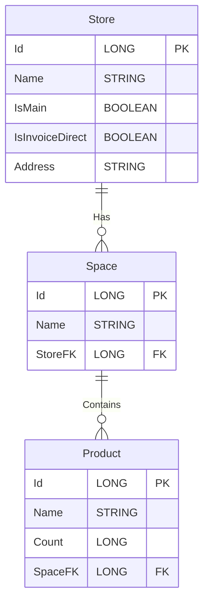
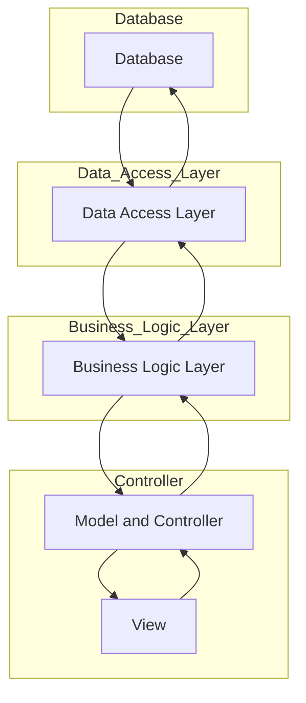

# StoreApp

### Database Digram

```mermaid
erDiagram
    Store {
        Id LONG "PK"
        Name STRING
        IsMain BOOLEAN
        IsInvoiceDirect BOOLEAN
        Address STRING
    }
    Space {
        Id LONG "PK" 
        Name STRING 
        StoreFK LONG "FK"
    }
    Product {
        Id LONG "PK"
        Name STRING
        Count LONG
        SpaceFK LONG "FK"
    }

    Store ||--o{ Space : "Has"
    Space ||--o{ Product : "Contains"
```
### System Digram

```mermaid
graph TD
    subgraph Database
        DB[Database]
    end

    subgraph Data_Access_Layer
        DAL[Data Access Layer]
    end

    subgraph Business_Logic_Layer
        BLL[Business Logic Layer]
    end

    subgraph Controller
        MC[Model and Controller]
    end
    subgraph Controller
        V[View]
    end

    DB --> DAL
    DAL --> DB
    DAL --> BLL
    BLL --> DAL
    BLL --> MC
    MC --> BLL
    V --> MC
    MC --> V
```

### How to use this project
1. First download database <a href="./helpers/">script</a> and run it.
2. Clone this project and run it.
